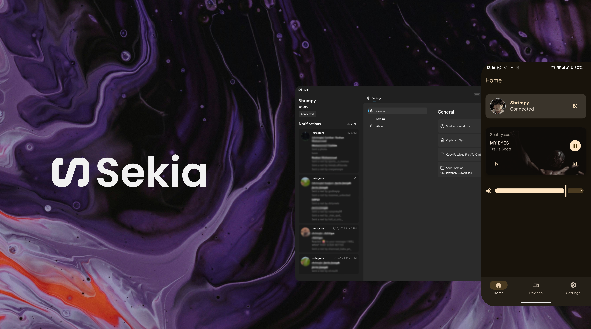
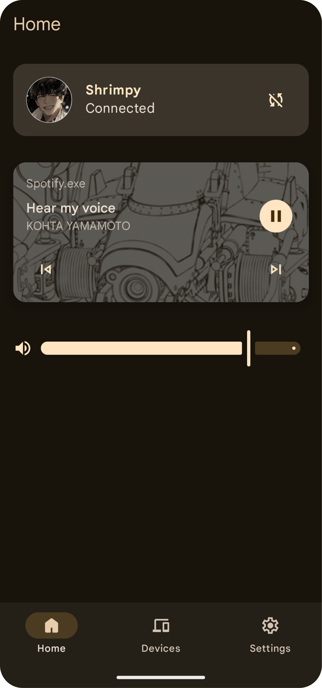

  

# Sekia

**Sekia** is an opinionated, custom-built app that bridges the gap between your Windows PC and Android phone, offering seamless clipboard, notification mirroring and more. Born out of the frustration with existing solutions, Sekia provides a straightforward, no-nonsense alternative for those who need more from their Phone Link experience.

## Features

- **Clipboard Sharing**: Seamlessly share clipboard content between your Android device and Windows PC.
- **Media Control**: Control media playback and volume of your PC from android.
- **File Sharing**: Share files between your devices easily.
- **Notification**: Allows toasting the notifications from your android in desktop.
- **Remote Control**: Control your phone from pc.

## Limitations

- **Clipboard Sharing on Android**:
   - Due to Android's restrictions, clipboard sharing is only possible via the share sheet.
- **Remote Control**:
   - Keyboard input works optimally on android 13+

## Installation

### Android
1. Get the APK from [Releases](https://github.com/shrimqy/Sekia/releases)
2. Download the Windows App, [**Seki**](https://github.com/shrimqy/Seki): [Microsoft Store](https://apps.microsoft.com/detail/9PJV6D1JPG0H?launch=true&mode=full).

## How to Use

1. **Setting Up**:
   - Permissions: Allow the app to post notifications, location access, restricted access from App Info (after trying to grant the notification access) and accessibility access to use your phone on pc.
   - Ensure both your Android device and Windows PC are connected to the same network.
   - Launch the app on your Windows PC.
   - Try to add a new device from the device card or device tab(Pull to refresh if it doesn't show any devices).

2. **Clipboard Sharing**:
   - Copy content on the desktop and it will automatically sync with your android (That is if you have enabled it from the settings).
   - To share clipboard from android you will have to manually sent it through the share sheet that shows after you perform a copy action).
3. **File Transfer**:
   - Use the share sheet from android/windows and select the app to share any files between the devices.
4. **Remote Control**:
   - Click the button next to the connection status button which will give a prompt to cast on your phone, choose the entire screen.

## Screenshots

## Roadmap

- Notification Actions.
- Exploring Device Files.

## Tech Stack

- **Android**: Kotlin, Jetpack Compose
- **Desktop**: [Seki](https://github.com/shrimqy/Seki) (WinUI 3, C#)
- **Network**: Mdns, Websockets.
