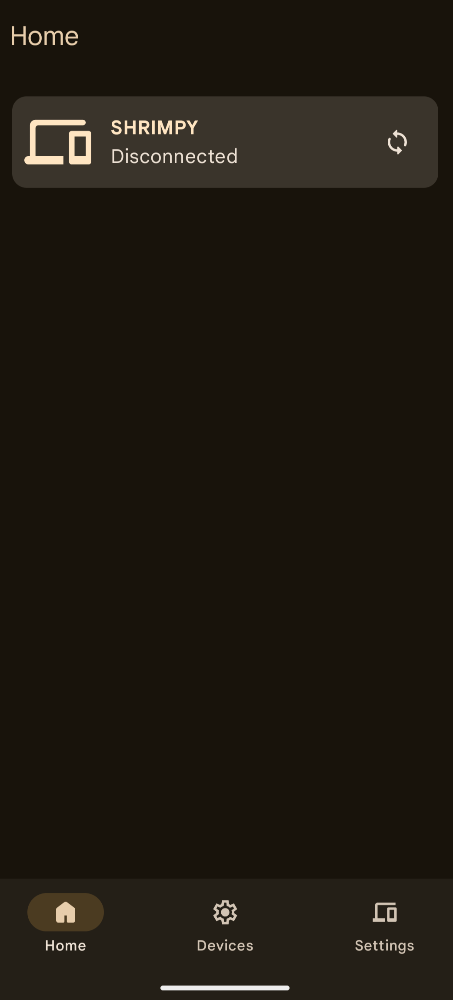

# Sekia

**Sekia** is an opinionated, custom-built app that bridges the gap between your Windows PC and Android phone, offering seamless clipboard and notification sharing. Born out of the frustration with existing solutions, Sekia provides a straightforward, no-nonsense alternative for those who need more from their Phone Link experience.

## Features

- **Clipboard Sharing**: Easily share clipboard content between your Android device and Windows PC.
- **Notification**: Allows toasting the notifications from your android in desktop.
- **Future Plans**:
    - File Sharing
    - Notification Actions
    - Device Controls (e.g., screen sharing, remote input)

## Tech Stack

- **Android**: Kotlin, Jetpack Compose
- **Desktop**: [Seki](https://github.com/shrimqy/Seki) (WinUI 3, C#)

## Installation

### Android

1. **Download the APK**
2. **Install the App**:
    - You might need to enable installation from unknown sources in your device settings.
3. **Permissions**:
    - Allow restricted access when prompted.
    - Grant notification permissions to enable notification mirroring.

### Windows

1. **Download the Windows App**: [Seki](https://github.com/shrimqy/Seki/).
2. **Install the Certificate**:
    - Manually install the provided certificate to ensure secure communication between devices.

## How to Use

1. **Set Up**:
    - Ensure both your Android device and Windows PC are connected to the same network.
    - Open Sekia on your Android device and grant the necessary permissions.
    - Launch the Sekia app on your Windows PC and follow any on-screen instructions.
2. **Clipboard Sharing**:
    - Copy content on the desktop and it will automatically sync with your android.
3. **Notification Mirroring**:
    - Receive your Android notifications directly on your Windows PC.

## Limitations

- **Clipboard Sharing on Android 13+**:
    - Due to Android's restrictions, clipboard sharing is only possible via the sharesheet after Android 13.
## License

Sekia is licensed under the MIT License. See [LICENSE](https://github.com/shrimqy/Sekia/blob/master/LICENSE) for more details.
